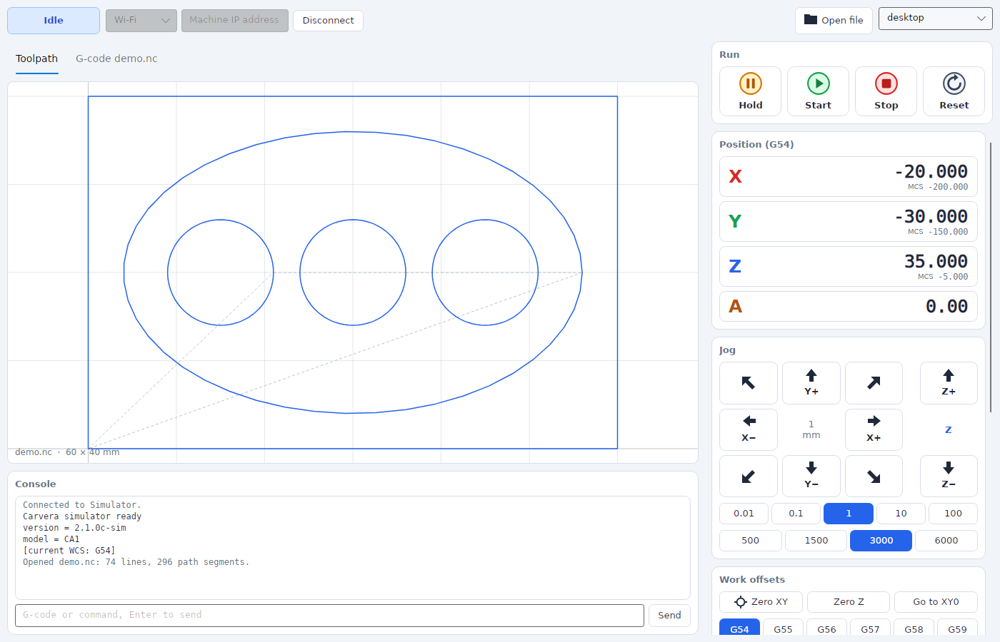
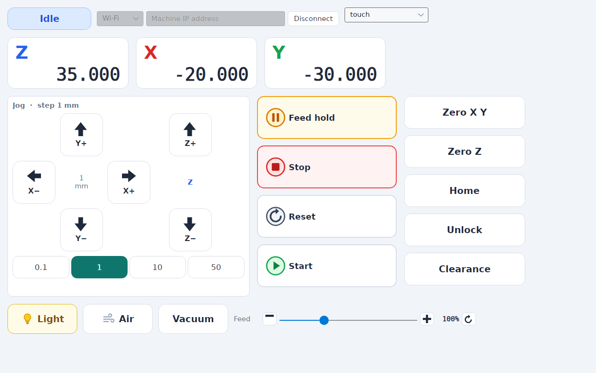
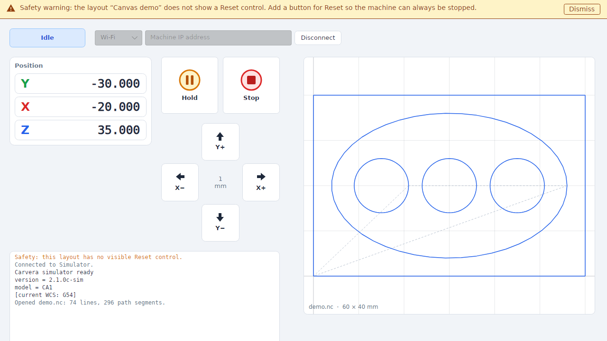

# Carvera Controller C#

A Windows controller for Makera Carvera CNC machines, written in C# with [Avalonia](https://avaloniaui.net). It is a port of the [Community Carvera Controller](https://github.com/danilius/Carvera_Controller) with one big difference: **every part of the user interface is defined by a JSON layout file that you can edit.**



## What you can do with layouts

- **Put anything anywhere.** Readouts, jog pads, buttons, overrides, console, previews: place them in rows, columns, grids, split panes, tabs, scrolling areas or at exact positions on a canvas. For example, show the axes as Z, X, Y across the top, or X/Y/Z stacked in a side panel.
- **Size things like a web page.** Leave out `width`/`height` and an element fills the available space. Use pixels, percentages, `auto` or weights (`2*`) when you want control. Give every region a size and the uncovered space simply stays empty.
- **Group and reuse.** Define a region (say, your DRO) once and place it in several spots, overriding its size or orientation each time.
- **Give every state its own graphics.** Each component can change its image, text, colours, border and font per state (normal, hover, pressed, disabled, on/off, selected, alarm...) and on any machine condition you can express, e.g. `machine.state == 'Hold'`.
- **Edit live.** Save the file and the window rebuilds. Mistakes are reported with their exact location, and the previous layout stays on screen.
- **Stay safe.** If a layout hides or omits Feed Hold, Stop or Reset, the app shows a warning.

| Touch panel layout | Canvas demo (with its deliberate safety warning) |
|---|---|
|  |  |

Start with the **[layout guide](docs/layouts.md)**. The **[layout reference](docs/layout-reference.md)** lists every element, property and command, and `schema/layout.schema.json` gives your editor autocompletion.

## Running it

Requires Windows 10/11 and the [.NET 10 SDK](https://dotnet.microsoft.com/download).

```powershell
dotnet run --project src/Carvera.App                     # remembers the last layout
dotnet run --project src/Carvera.App -- --layout touch   # a specific layout
dotnet run --project src/Carvera.App -- --connect simulator
./build/publish.ps1                                      # self-contained build in publish/
```

Connect with the bar at the top: **Wi-Fi** (machine IP address; **Find** listens for machines on the network), **USB** (COM port) or **Simulator**, which needs no hardware.

## Project layout

| Path | Contents |
|---|---|
| `src/Carvera.Core` | Machine connection and protocol, state store, commands, expressions, simulator, G-code preview parser |
| `src/Carvera.Layout` | Layout file model, loader, validator, safety analysis, schema generator |
| `src/Carvera.App` | Avalonia app: layout engine, components, window |
| `layouts/` | Shipped layouts and their graphics |
| `schema/` | Generated JSON schema for layout files |
| `docs/` | [Layout guide](docs/layouts.md), [reference](docs/layout-reference.md), [architecture and porting status](docs/architecture.md) |
| `tests/` | Protocol, layout and controller tests (`Carvera.Tests`), plus headless UI tests that also render layout previews (`Carvera.App.Tests`) |

```powershell
dotnet test                              # all tests; UI tests run headless
$env:UPDATE_GENERATED=1; dotnet test     # refresh the schema and reference after changing components or commands
```

## Status

This is an early port. Machine connection, status, jogging, work offsets, overrides, switches, run control, MDI, the console and a 2D G-code preview are in place. File transfer, the 3D viewer, probing, pendants and other features are still to come; see [docs/architecture.md](docs/architecture.md#status-of-the-port).

**It has not been tested against a real machine yet.** Use it with care, and keep a hand near the machine's physical stop button.

## License

GPL-2.0, like the controller it is ported from. See [LICENSE](LICENSE) and [NOTICE](NOTICE).
