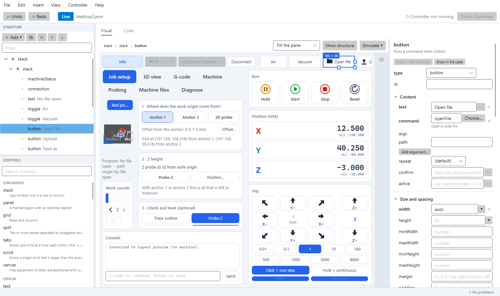
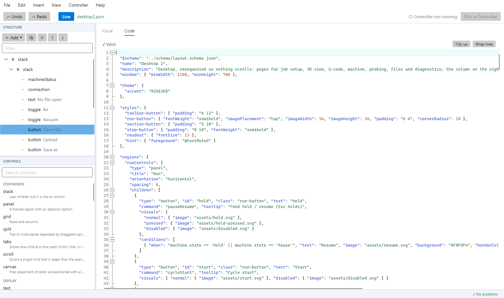

# The layout editor

`CarveraLayoutEditor.exe` is a separate program for building and changing layouts. It is meant to sit on one screen while the Controller runs on the other: **every valid change you make is written to the layout file at once, and the Controller shows it within a moment**, keeping its tab, scroll position and splitters.

It edits the same JSON files described in the [layout guide](layouts.md); nothing about the format changed. Everything in the editor can also be done in the **Code** tab, and the other way round.

## Starting it

- `./build/publish.ps1` publishes the Controller and the editor side by side and updates two shortcuts in the repository root.
- From source: `dotnet run --project src/Carvera.Editor` (options: `--layout <name>` or a path to a `.json` file).
- With no option the editor opens the layout the Controller is showing (if it is running), otherwise the one you edited last, otherwise `desktop2`.

## How the two programs work together

| | |
|---|---|
| **Live** (toolbar) | On: each valid edit is saved immediately. Off: nothing is written until you save (Ctrl+S). |
| **Errors are held back** | The editor checks every edit with the same loader and validator the Controller uses. A layout with errors is not saved; the Controller keeps the last good layout and the editor says why. Warnings (for example, no Stop button) do not block a save. |
| **Built-in layouts** | `desktop` and `desktop2` ship with the program. Editing one saves a copy with the same name in `%APPDATA%\CarveraControllerCS\layouts`, which the Controller prefers over the built-in one, so a rebuild of the program cannot overwrite your work. *File ▸ Discard my copy* goes back to the built-in version. Files you open with *File ▸ Open file* are edited in place. |
| **Show in the Controller** | Selecting something in the editor makes the Controller switch to the tab that holds it and outline it for a moment (turn this off in the *Controller* menu). |
| **Pick in Controller** | Press it, then click any element in the Controller's window: it is selected in the editor. Esc in the Controller stops. While picking, clicks in the Controller do not press its buttons. |
| **Show this in the Controller** | If the Controller shows another layout, this button makes it load the one you are editing. |

The link is a named pipe that only your Windows user can open. It carries no machine commands: only "show this element", "pick mode", "load this layout" and the names of the layouts involved.

The preview inside the editor never touches a machine: it runs the real layout engine against a controller that is "connected" to a stream that swallows everything.

## The window

- **Left, top: Structure.** The layout as a tree: the root element and everything in it, then *Regions*, *Styles*, *Theme*, *Shortcuts*, *Window* and *Layout details*. Problems show as a red or amber dot. Drag rows to move elements (top part of a row = before it, middle = inside it, bottom = after it). Right-click for the element menu. The filter box narrows the tree.
- **Left, bottom: Controls.** Every element type, grouped, with a search box. Drag one into the preview or the tree, or double-click to add it to the selection. The regions of the layout are listed too.
- **Right: two tabs.**
  - **Visual**: the layout as it looks, plus the inspector.
  - **Code**: the JSON text.

### Visual tab

- **Click** an element to select it (Alt+click selects the container around it; Esc selects the parent). The breadcrumb above the preview shows where you are and jumps to any container.
- **Drag** an element to move it: a green line shows where it lands in a row or column; a grid shows the cell; a canvas takes the pointer position as `x`/`y`. **Drag the square handles** on the right edge, bottom edge or corner to set `width`/`height` in pixels. Drag from the Controls list to add.
- **Right-click** for the element menu: add inside, duplicate, delete, move up/down, wrap in (stack, panel, scroll, grid, split, tabs), unwrap, make a region, copy, cut, paste.
- **Show structure** outlines every container, including ones that draw nothing.
- **Size** chooses the screen size the layout is drawn for: *Fill the pane* (the layout uses the whole area, like a resizable window), presets such as 1920 × 1080, 1024 × 600 (touch) or 800 × 480, or *Custom size…* for any width × height.
- **Zoom** (− / + buttons, the list, or Ctrl + mouse wheel) scales the preview: *Fit* shrinks or grows the chosen screen to fill the pane, a percentage shows it at that scale and scrolls. Design for 1920 × 1080 on a small monitor, then zoom in to place things exactly.
- **Tabs:** click a tab header in the preview to show that page (the page is selected too). Select a tab container to get a button per page in the inspector, or select a page in the tree. The Controller follows.
- **Simulate** previews the layout in another machine state: disconnected, idle, running a job, feed hold, alarm; with the sample G-code loaded; or with any state values you type (`job.percent = 80`). This is how you check `conditions`, `visible` and `enabled` expressions. Only the preview changes.

The **inspector** (right) shows the selected element's properties in groups: *Content* (what is particular to the element), *Size and spacing*, *Placement in its container* (grid cell, canvas position, tab title), *Visibility and help*, *Appearance* (classes, style, per-state visuals, conditions) and any property the element does not use. Settings you have made are in bold, with a ✕ to remove them. Fields check what you type: expressions and text templates are parsed, sizes and spacing are validated, commands must exist. Command arguments are offered by name from the command's definition. Colours offer the theme colours and a picker; pictures can be built-in icons or files (a file from elsewhere is copied next to the layout).

Selecting a **style**, the **theme**, a **shortcut**, the **window** or the **layout details** in the tree shows the matching form. Shortcuts can record the keys you press.

### Code tab

Syntax colouring, folding, search (Ctrl+F), wavy underlines where the layout has errors or warnings (hover for the message and for the description of the property under the pointer), and **completion** (Ctrl+Space, and as you type quotes and letters): property names for the kind of element around the caret, and values for the property (enum values, commands, colours, state paths, region and style names). The text is checked a moment after you stop typing. If the JSON is broken the visual side waits and the Controller keeps its last layout. *Tidy up* rewrites the file with regular indentation.

The editor writes files in the style of the shipped layouts (small objects on one line). Comments in a file are kept while you only use the Code tab, but a visual edit rewrites the file without them; undo brings them back.

### Undo and redo

Ctrl+Z / Ctrl+Y (or the toolbar) undo and redo every change from both tabs as one history. Typing in one field is one step.

## Keys

| | |
|---|---|
| Ctrl+S / Ctrl+Shift+S | Save / Save as |
| Ctrl+Z, Ctrl+Y | Undo, redo |
| Ctrl+C, Ctrl+X, Ctrl+V | Copy, cut, paste an element (as JSON text, so it also works between editor windows) |
| Ctrl+D, Delete | Duplicate, delete |
| Alt+↑ / Alt+↓ | Move the element up / down among its siblings |
| Esc | Select the container |
| Ctrl+1, Ctrl+2 | Visual, Code |
| Ctrl+Space | Completion (Code tab) |
| F5 | Show the selection in the Controller |
| Ctrl+Shift+M | Show or hide the problems list |

## Things to know

- Regions: an element inside a region is edited in the region, so it changes everywhere the region is used. The inspector says when an element is a *use* of a region; *Go to region* jumps to it.
- A `scroll` holds one element; put a stack in it first.
- Deleting a region that is still used is refused. Deleting a style removes its name from every element that used it.
- If the layout file is changed by another program while you have unsaved edits, the editor asks which version to keep.
